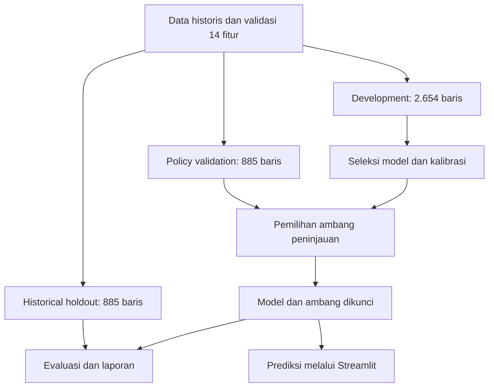

<div align="center">

# Student Success

**Dropout Risk & Academic Outcome Prediction**

[](requirements.txt)
[](app.py)
[](student_success/README.md)
[](https://github.com/mpnabil95/student-success-prediction/actions/workflows/quality.yml)
[](LICENSE)
[](docs/DATA_CARD.md)

Studi kasus Data Science untuk memprediksi status studi mahasiswa menggunakan data pendaftaran dan capaian semester pertama, serta membantu dosen wali menentukan profil yang perlu ditinjau lebih lanjut.

[**Buka demo**](https://student-success-prediction-95.streamlit.app/) · [**Mulai membaca**](#mulai-dari-sini) · [**Lihat notebook**](notebook.ipynb) · [**Panduan aplikasi**](docs/APP_GUIDE.md) · [**Peta file**](docs/REPOSITORY_GUIDE.md) · [**Dokumentasi**](docs/README.md)

</div>

> **Batas penggunaan:** ini adalah demonstrasi prediksi retrospektif dari data historis. Dataset tidak mencatat tanggal dropout setiap mahasiswa; hasil belum membuktikan bahwa prediksi selalu dibuat sebelum kejadian. Aplikasi mendukung peninjauan oleh manusia dan tidak digunakan untuk keputusan akademik otomatis.

## Daftar isi

- [Mulai dari sini](#mulai-dari-sini)
- [Latar belakang dan tujuan](#latar-belakang-dan-tujuan)
- [Skenario prediksi](#skenario-prediksi)
- [Dataset](#dataset)
- [Fitur aplikasi](#fitur-aplikasi)
- [Hasil dan maknanya](#hasil-dan-maknanya)
- [Metodologi dan alur project](#metodologi-dan-alur-project)
- [Struktur repository](#struktur-repository)
- [Menjalankan project](#menjalankan-project)
- [Reproduksi dan pengujian](#reproduksi-dan-pengujian)
- [Deployment](#deployment)
- [Keterbatasan dan pengembangan berikutnya](#keterbatasan-dan-pengembangan-berikutnya)
- [Asal project dan arsip](#asal-project-dan-arsip)
- [Lisensi dan atribusi](#lisensi-dan-atribusi)

## Mulai dari sini

Tidak perlu membuka seluruh folder untuk memahami project ini. Pilih jalur sesuai tujuanmu.

| Saya ingin… | Mulai di sini | Lanjut jika diperlukan |
|---|---|---|
| Memahami masalah dan hasil dalam beberapa menit | Latar belakang, skenario, dan hasil pada halaman ini | [Business case](docs/BUSINESS_CASE.md) |
| Mencoba prediksi tanpa membaca kode | [Menjalankan project](#menjalankan-project) | [Panduan aplikasi](docs/APP_GUIDE.md) dan [contoh CSV](examples/README.md) |
| Menilai kualitas analisis dan model | [Notebook](notebook.ipynb) | [Model card](docs/MODEL_CARD.md) dan [laporan evaluasi](reports/README.md) |
| Memahami fungsi setiap file | [Peta repository](docs/REPOSITORY_GUIDE.md) | README di folder yang ingin dipelajari |
| Mengembangkan atau mengulang eksperimen | [Kode inti](student_success/README.md) | [Reproduksi](docs/REPRODUCIBILITY.md), [scripts](scripts/README.md), dan [tests](tests/README.md) |

**Istilah singkat:** *model* adalah pola yang dipelajari komputer dari data; *fitur* adalah informasi masukan; *prediksi* adalah perkiraan, bukan kepastian. Penjelasan istilah lainnya tersedia di [peta repository](docs/REPOSITORY_GUIDE.md#kamus-singkat).

## Latar belakang dan tujuan

Dalam studi kasus Dicoding, Jaya Jaya Institut adalah institusi pendidikan fiktif yang ingin memahami permasalahan dropout. Project ini mengembangkan submission tersebut menjadi portofolio yang menghubungkan analisis data, pemodelan, evaluasi, dan aplikasi interaktif.

Pertanyaan yang dijawab:

1. Bagaimana komposisi status studi dan capaian akademik pada data historis?
2. Seberapa baik data pendaftaran dan semester pertama dapat memprediksi status studi?
3. Bagaimana probabilitas dropout dapat membantu menentukan prioritas peninjauan?
4. Berapa banyak kasus yang teridentifikasi, terlewat, atau ditandai secara keliru?

Pengguna demonstrasi adalah dosen wali atau tim pendampingan akademik. Manfaat yang dituju adalah membantu peninjauan profil; **penurunan dropout atau keberhasilan intervensi belum diukur**. Rancangan pilot dan calon pelaksana tersedia di [BUSINESS_CASE.md](docs/BUSINESS_CASE.md).

## Skenario prediksi

| Aspek | Keputusan |
|---|---|
| Informasi masukan | 8 fitur pendaftaran dan 6 fitur akademik semester 1 |
| Target | Status pada akhir durasi normal program sebagaimana dilabeli dalam dataset |
| Tiga kemungkinan status | **Dropout**: keluar; **Enrolled**: masih terdaftar dan belum selesai; **Graduate**: lulus |
| Prediksi status | Kelas dengan probabilitas paling tinggi |
| Prioritas peninjauan | Menggunakan probabilitas Dropout dan ambang yang dipilih pada data validasi |
| Pengambil keputusan | Manusia yang mengonfirmasi kondisi mahasiswa |

Semester pertama menunjukkan batas informasi masukan, **bukan waktu terjadinya dropout atau waktu mahasiswa akan lulus**. Enrolled juga tidak berarti mahasiswa pasti aman atau nantinya akan lulus.

Fitur semester 2 dikeluarkan. Status finansial dan indikator makroekonomi yang waktu pencatatannya belum jelas, serta sejumlah atribut demografi dan keluarga, juga tidak dipakai model utama. Usia saat masuk tetap digunakan. Alasan dan seluruh nama kolom tersedia dalam [kamus fitur](docs/FEATURE_DICTIONARY.md) dan [data card](docs/DATA_CARD.md).

## Dataset

Dataset berasal dari **Predict Students' Dropout and Academic Success** (UCI), melalui distribusi Dicoding Academy. Data bersumber dari pendidikan tinggi di Portugal; bukan catatan mahasiswa Jaya Jaya Institut atau kampus di Indonesia.

| Karakteristik snapshot | Nilai |
|---|---:|
| Jumlah baris mahasiswa | 4.424 |
| Kolom sumber | 37, termasuk target `Status` |
| Fitur model utama | 14 |
| Graduate | 2.209 |
| Dropout | 1.421 |
| Enrolled | 794 |
| Nilai kosong eksplisit / duplikat baris penuh | 0 / 0 |

Tidak adanya nilai kosong eksplisit tidak berarti semua informasi lengkap: sumber juga menggunakan kode kategori “Unknown”. Snapshot mentah dipertahankan untuk penelusuran asal data.


[File dan cara membaca data](data/README.md) · [Asal data, checksum, dan batas penggunaan](docs/DATA_CARD.md) · [Bukti pemeriksaan data](reports/data_quality.json)

## Fitur aplikasi

| Halaman | Yang dapat dilakukan | Cara membaca hasil |
|---|---|---|
| **Gambaran Data** | Filter program/usia dan reset, diagram donat, grafik capaian interaktif, minimum ukuran kelompok, dan ekspor ringkasan program | Ringkasan historis mengikuti filter, bukan pemantauan mahasiswa aktif |
| **Prediksi Individu** | Formulir bertab di samping panel hasil, 14 fitur, preset sintetis, probabilitas tiga kelas, saran, dan unduhan CSV | Status paling mungkin dan kategori peninjauan adalah dua keluaran berbeda |
| **Prediksi Batch** | Unggah CSV atau gunakan contoh sintetis, filter tindakan, urutkan peluang Dropout, dan unduh seluruh/hasil terfilter | Batas 10 MB dan 10.000 baris; satu baris tidak valid menghentikan seluruh batch |
| **Kinerja Model** | Tab hasil evaluasi, seleksi model, diagnostik, dan batas penggunaan dengan grafik interaktif | Performa historis tidak menjamin hasil pada populasi baru |

Antarmuka menggunakan tema terang dengan aksen teal, panel yang konsisten, dan grafik Altair dengan tooltip. Aturan CSS untuk layar kecil disertakan; tampilan browser belum dapat diverifikasi pada lingkungan pembaruan ini.

Formulir dan CSV menggunakan aturan validasi yang sama. Kategori harus sesuai kamus, nilai akademik mengikuti skala sumber, dan relasi jumlah unit diperiksa. Unggahan diproses dalam sesi aplikasi dan tidak ditulis ke file project.

Panduan langkah demi langkah, arti kolom unduhan, dan contoh interpretasi tersedia pada [APP_GUIDE.md](docs/APP_GUIDE.md). Contoh unggahan tersedia pada [examples/](examples/README.md).

## Hasil dan maknanya

<!-- MODEL_RESULTS:START -->
Model terpilih: **random_forest**, dengan kalibrasi sigmoid dan threshold peninjauan **0.19**. Angka berikut berasal dari **885 baris holdout historis**; rincian tersedia di [model card](docs/MODEL_CARD.md) dan [metrics.json](reports/metrics.json).

| Ukuran | Hasil | Arti praktis |
|---|---:|---|
| Accuracy tiga kelas | 70.85% | Bagian status yang diprediksi benar |
| Macro F1 | 0.6129 | Rata-rata F1 dengan bobot sama untuk ketiga kelas |
| Weighted F1 | 0.6904 | F1 dengan bobot sesuai jumlah contoh setiap kelas |
| Recall kebijakan Dropout | 88.03% | Bagian kasus Dropout aktual yang ditandai |
| Precision kebijakan Dropout | 54.82% | Bagian profil yang ditandai dan memang berstatus Dropout |
| Review rate | 51.53% | Bagian seluruh profil yang membutuhkan peninjauan |
| Dropout average precision | 0.7788 | Ringkasan hubungan precision dan recall di berbagai ambang |

Pada ambang ini, **250 dari 284 kasus Dropout** teridentifikasi dan **34 kasus** terlewat. Ada **206 profil selain Dropout** yang juga ditandai, sehingga total **456 profil** perlu ditinjau. Recall tinggi disertai beban kerja yang besar; kapasitas tim nyata belum ditetapkan.

**Holdout ini pernah dilihat pada submission lama.** Angka tersebut bukan validasi eksternal independen dan tidak dibandingkan langsung sebagai peningkatan atas model lama yang menggunakan fitur semester 2 serta finansial.
<!-- MODEL_RESULTS:END -->

**Klasifikasi status berbeda dari kebijakan peninjauan.** Contohnya, probabilitas Graduate 0,55, Dropout 0,25, dan Enrolled 0,20 menghasilkan status paling mungkin Graduate. Dengan ambang peninjauan 0,19, profil itu tetap perlu ditinjau karena probabilitas Dropout melampaui ambang. Angka contoh ini bersifat ilustratif.

| Seleksi kandidat | Perbandingan precision dan recall |
|---|---|
|  |  |

Grafik ini berasal dari hasil analisis; bukan tangkapan layar aplikasi. [Panduan seluruh grafik](reports/figures/README.md) menjelaskan cara membaca masing-masing gambar.

## Metodologi dan alur project



1. **Persiapan data:** validasi checksum dan kontrak fitur. Standardisasi numerik dan pengkodean kategori dipelajari di dalam pipeline training.
2. **Seleksi model:** bandingkan DummyClassifier, Logistic Regression, Random Forest, dan HistGradientBoosting menggunakan rata-rata macro F1 pada 5-fold cross-validation di data development.
3. **Kalibrasi:** kandidat machine learning menggunakan kalibrasi sigmoid 3-fold di dalam data training, untuk menyesuaikan probabilitas dengan pola kejadian yang diamati.
4. **Pemilihan kebijakan:** pilih ambang yang memaksimalkan F2 pada policy validation. F2 memberikan bobot lebih besar pada recall.
5. **Evaluasi:** hitung hasil holdout, interval bootstrap, kesalahan kelompok, dan permutation importance setelah model serta ambang dikunci.
6. **Penggunaan:** aplikasi memuat model terlatih yang sama; tidak melakukan training saat pengguna meminta prediksi.

Model akhir dilatih pada data development saja; tidak dilatih ulang menggunakan seluruh data setelah evaluasi. Detail keputusan tersedia pada [protokol reproduksi](docs/REPRODUCIBILITY.md) dan [model card](docs/MODEL_CARD.md).

## Struktur repository

Folder project memiliki README yang menjelaskan file di dalamnya. Khusus `.github/`, panduannya bernama `GUIDE.md` agar tidak mengambil prioritas README utama pada beranda GitHub. Mulai dari fungsi folder sebelum membuka kode atau keluaran mesin.

| Lokasi | Isi dalam bahasa sederhana | Panduan |
|---|---|---|
| `app.py` | Pintu masuk aplikasi | [Cara menggunakan aplikasi](docs/APP_GUIDE.md) |
| `notebook.ipynb` | Cerita analisis, kode, dan hasil dalam satu dokumen | [Buka notebook](notebook.ipynb) |
| `data/` | Data mentah yang menjadi sumber eksperimen | [README data](data/README.md) |
| `artifacts/` | Model terlatih dan informasi yang dibutuhkan saat memprediksi | [README artifacts](artifacts/README.md) |
| `reports/` | Bukti hasil eksperimen: metrik, prediksi evaluasi, dan grafik | [README reports](reports/README.md) |
| `docs/` | Penjelasan masalah, metodologi, penggunaan, dan riwayat project | [Indeks dokumentasi](docs/README.md) |
| `student_success/` | Kode inti yang dipakai training dan aplikasi | [README kode inti](student_success/README.md) |
| `scripts/` | Perintah bantuan untuk membangun notebook, dokumen, dan verifikasi | [README scripts](scripts/README.md) |
| `examples/` | Tiga profil sintetis untuk mencoba unggahan | [README examples](examples/README.md) |
| `tests/` | Pemeriksaan otomatis perilaku kode dan aplikasi | [README tests](tests/README.md) |
| `.github/` | Otomatisasi pengujian di GitHub | [Panduan GitHub](.github/GUIDE.md) |
| `.streamlit/` | Pengaturan tampilan dan unggahan aplikasi | [README Streamlit](.streamlit/README.md) |

Seluruh file pada root, jenis file, hubungan antar-folder, dan aturan penyuntingan dijelaskan di [REPOSITORY_GUIDE.md](docs/REPOSITORY_GUIDE.md).

## Menjalankan project

Gunakan **Python 3.12** dan Git. Seluruh perintah berikut dijalankan dari root repository, yaitu folder yang memuat `app.py`. Model terlatih dan dataset sudah disertakan; tidak perlu melatih model untuk mencoba aplikasi.

### 1. Clone repository

```bash
git clone https://github.com/mpnabil95/student-success-prediction.git
cd student-success-prediction
```

### 2. Siapkan environment

**Windows PowerShell:**

```powershell
py -3.12 -m venv .venv
.\.venv\Scripts\python.exe -m pip install -r requirements.txt
.\.venv\Scripts\python.exe -m streamlit run app.py
```

Perintah ini langsung menggunakan Python di `.venv`, sehingga tidak memerlukan aktivasi melalui `Activate.ps1`.

**macOS / Linux:**

```bash
python3.12 -m venv .venv
source .venv/bin/activate
python -m pip install -r requirements.txt
python -m streamlit run app.py
```

Buka alamat lokal yang ditampilkan terminal, biasanya `http://localhost:8501`. Hentikan aplikasi dengan `Ctrl+C` di terminal.

### 3. Pilih kebutuhan dependensi

| File | Kapan digunakan |
|---|---|
| [requirements.txt](requirements.txt) | Menjalankan aplikasi dan pipeline model |
| [requirements-notebook.txt](requirements-notebook.txt) | Seluruh dependensi aplikasi, ditambah Jupyter dan alat notebook |
| [pyproject.toml](pyproject.toml) | Metadata paket Python; tidak menggantikan daftar dependensi di atas |

Untuk membuka notebook di Windows:

```powershell
.\.venv\Scripts\python.exe -m pip install -r requirements-notebook.txt
.\.venv\Scripts\python.exe -m jupyter lab notebook.ipynb
```

Di macOS/Linux dengan environment aktif, gunakan `python` sebagai pengganti `.\.venv\Scripts\python.exe`.

Jika muncul error versi model, instal versi dari `requirements.txt`. Jika validasi input gagal, cocokkan data dengan [kamus fitur](docs/FEATURE_DICTIONARY.md); jangan mengubah angka hanya agar prediksi berhasil.

## Reproduksi dan pengujian

Notebook yang disertakan berisi 41 sel, termasuk 28 sel kode yang sudah dieksekusi melalui builder Python. [Catatan verifikasi paket](docs/VALIDATION.md) memuat pemeriksaan lokal dan batasnya; bukti CI historis dicatat secara terpisah.

Workflow [Project quality, run 35210959197](https://github.com/mpnabil95/student-success-prediction/actions/runs/35210959197) pada baseline `0fa0c24` telah berhasil saat audit. Workflow pembaruan ini memakai dua job: memeriksa paket yang di-commit terlebih dahulu, kemudian membangun ulang eksperimen dan membandingkan hasilnya dengan snapshot commit. Status kedua job harus diperiksa pada commit baru sebelum release.

Paket perbaikan audit diuji lokal dengan **39 tes lulus tanpa skip**: kontrak model/input, struktur CSV, pemeriksaan paket, Streamlit AppTest, serta aset UI. Lihat [cakupan tes](tests/README.md), [kesiapan release](docs/RELEASE_READINESS.md), dan [riwayat UI](docs/UI_CHANGELOG.md).

Dengan environment aktif dan dependensi notebook terpasang:

```bash
python scripts/verify_package.py --read-only
```

Di Windows tanpa aktivasi, ganti `python` dengan `.\.venv\Scripts\python.exe`.

Untuk **mengulang eksperimen dan memperbarui notebook**:

```bash
python scripts/build_notebook.py
python scripts/build_docs.py
python scripts/verify_package.py
```

Builder notebook juga menjalankan training; tidak perlu menjalankan training terpisah sebelumnya. Proses ini menulis ulang keluaran eksperimen. Lihat [scripts/README.md](scripts/README.md) untuk daftar file yang berubah dan [protokol reproduksi](docs/REPRODUCIBILITY.md) untuk batas pengulangan.

## Deployment

Konfigurasi yang disiapkan untuk Streamlit Community Cloud:

| Pengaturan | Nilai |
|---|---|
| Repository | `mpnabil95/student-success-prediction` |
| Branch | `main` |
| Entry point | `app.py` |
| Python | 3.12 |
| Dependensi | `requirements.txt` |
| Model | Tiga file yang konsisten dalam `artifacts/` |

[Buka dashboard publik](https://student-success-prediction-95.streamlit.app/). Halaman desktop dan alur dasar baseline telah diperiksa saat audit; perubahan paket ini memerlukan pemeriksaan deployment setelah commit. Keberhasilan CI tidak menggantikan pemeriksaan browser. Setelah mengganti artefak model, mulai ulang aplikasi agar cache tidak mencampur versi.

## Keterbatasan dan pengembangan berikutnya

- **Waktu kejadian tidak tersedia.** Belum ada bukti bahwa seluruh prediksi mendahului dropout.
- **Holdout pernah dilihat pada submission lama.** Evaluasi ini bukan validasi eksternal independen atau evaluasi cohort baru.
- **Enrolled adalah hasil yang belum selesai.** Performa kelas ini masih lemah; lihat rincian per kelas di model card.
- **Konteks sumber berbeda.** Data Portugal memerlukan validasi dan pemetaan kategori sebelum dipakai di institusi lain.
- **Kapasitas peninjauan belum ditetapkan.** Ambang dengan recall tinggi juga dapat menambah beban kerja dan false positive.
- **Penjelasan bukan sebab-akibat.** Feature importance tidak membuktikan penyebab dropout; saran aplikasi berupa aturan transparan, bukan efek intervensi yang telah diukur.
- **Eksklusi atribut tidak menjamin fairness.** Evaluasi kelompok membantu diagnosis, tetapi bukan bukti bahwa model bebas bias.

Prioritas pengembangan: verifikasi deployment dan pengalaman pengguna, evaluasi pada cohort baru dengan waktu kejadian yang jelas, penetapan kapasitas peninjauan bersama pengguna, dan pengukuran manfaat pendampingan melalui pilot.

## Asal project dan arsip

Project ini bermula dari submission **Dicoding — Penerapan Data Science: Menyelesaikan Permasalahan Institusi Pendidikan**. Versi portofolio memperjelas skenario, pemisahan evaluasi, validasi input, serta konsistensi model dan aplikasi.

- [Branch original submission](https://github.com/mpnabil95/student-success-prediction/tree/dicoding-submission)
- [Release arsip Dicoding](https://github.com/mpnabil95/student-success-prediction/releases/tag/dicoding-submission-v1.0.0)
- [Perbaikan berdasarkan audit](docs/AUDIT_REMEDIATION.md)
- [Panduan migrasi historis](docs/MIGRATION.md)

## Lisensi dan atribusi

Kode menggunakan [MIT License](LICENSE). Dataset mengikuti **CC BY 4.0** dari sumber UCI; lisensi kode tidak menggantikan ketentuan atribusi data.

- [Distribusi dataset Dicoding Academy](https://github.com/dicodingacademy/dicoding_dataset/tree/main/students_performance)
- [Sumber UCI dan DOI](https://doi.org/10.24432/C5MC89)
- [Data card](docs/DATA_CARD.md) dan [metadata sitasi project](CITATION.cff)

Sitasi dataset:

> Realinho, V., Vieira Martins, M., Machado, J., & Baptista, L. (2021). *Predict Students' Dropout and Academic Success* [Dataset]. UCI Machine Learning Repository. https://doi.org/10.24432/C5MC89

Dikembangkan oleh **[Muhammad Pangeran Nabil](https://github.com/mpnabil95)** untuk pembelajaran dan portofolio Data Science. Jaya Jaya Institut adalah konteks fiktif dalam submission; project ini tidak mengklaim implementasi operasional di institusi tersebut.
